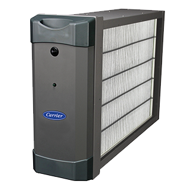

  <h2 class="no-margin">Breathe Better Indoors With Our Air Purifier Services</h2>
  

Indoor pollutants like bacteria, dust mites, animal dander, and viruses can deteriorate the quality of air inside your home. We believe that you can improve this by using quality air purifiers from Carrier.

At Greiber Heating & Sheet Metal, we treat your property like our own and will work with you to ensure the best [indoor air quality](/products/indoor-air-quality/). We'll find the potential problem areas inside your property and provide cleaner solutions that will benefit everyone. <a href="/contact/">Get in touch</a> with us if you have any questions.

### Trust Carrier to Provide the Best in Indoor Air Quality

If you get the right air purifier for your home it will have a positive impact on you and your family’s health. Trust us to provide premier air cleaning and **Captures & Kills™** technology.

#### How Does it Work?

Carrier air purifiers treat 100% of the air flowing through home comfort system using a unique three-step process:

- Step 1: Precision point ionization charges particles as they enter the purifier.
- Step 2: A specially designed, continuously charged media captures airborne particles.
- Step 3: Patented, state-of-the-art technology kills captured viruses, bacteria, and mold and can prevent.
