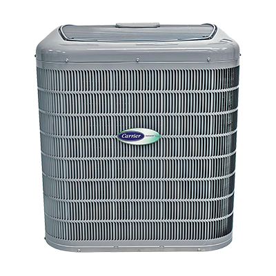

  <h2 class="no-margin">Our Cooling Services Will Help You Easily Beat the Heat</h2>
  

Whether you require an installation or a replacement of an air conditioner, Greiber Heating & Sheet Metal is the name that you can trust. You can be confident that our dedicated experts will provide exceptional AC services that will ensure your peace of mind during the summer months.

In case you're experiencing any difficulties with your existing AC, rely on our professionals to provide top quality repair on the same day. We're specialists when it comes to servicing the Carrier Infinity 21 model. Count on us to provide factory guarantees as well. <a href="/contact/">Contact us</a> for more details.

### Let Us Take Care of All Your AC Needs

- AC installation
- AC repair
- AC replacement

Rely on us to service all the [products](/products/) from Carrier.
