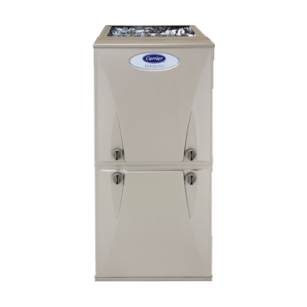

  <h2 class="no-margin">Feel Warm and Toasty at Home With Our Heating Services</h2>
  

If you look forward to enjoying a cozy winter at home, you should ensure that your heating system is working perfectly at all times. No matter the problem, the professionals at Greiber Heating & Sheet Metal will be able to diagnose it quickly and provide the necessary repair.

We're here to work according to your wishes. Based on your specifications and residential property's design, we'll install a heating system that will make you feel relaxed and help save energy as well.

Our priority is to take care of your comfort and provide you with quality installation and repair services always. We're experienced in installing and servicing the [Carrier Infinity 98](/products/furnaces/) which is highly efficient, easily controlled, quiet, and meets the green standards.

### Get the Perfect Sheet Metal for Your Heating System

When it comes to the installation of your heating system, you require a metal duct that fits your duct space perfectly. And, as our name suggests, we're experts at crafting sheet metal ducts that are tailor-made to the job specifications.

With over four generations of experience, we've understood that every heating duct spacing need is different and strive to provide unique solutions always. <a href="/contact/">Get in touch</a> with us for more information.
